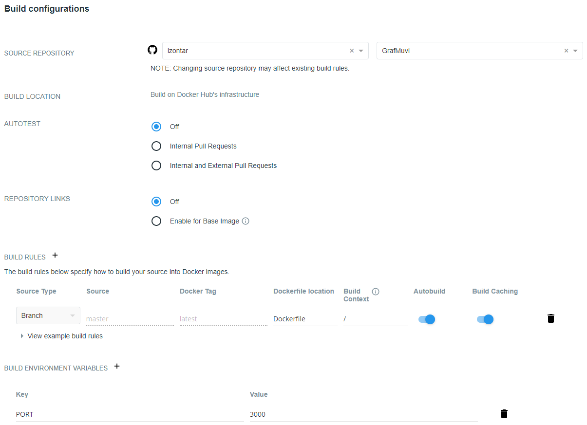

## :whale: How is containerization used?
Because of the fact that code in different environment might work differently, may be even buggy in other environments, we will implement containerization in our RESTful API.
This is why we should use *containers* in software development. *Containerization* involves bundling the application with all its configuration files, libraries, dependencies and thus provides a consistent environment. Our RESTful API will use [Docker](https://www.docker.com/) as the containerization tool. It's a set of Platform as a Service (PaaS) products, which rely on the use of OS-level containerization.
### Configuration files
##### Dockerfile
*Dockerfile* is the configuration file of *Docker* obviously. It contains the necessary instruction to create the environment of our application. Each Docker image consists of read-only layers, where each represent a Dockerfile instruction. You can check [GrafMuvi Dockerfile](https://github.com/lzontar/GrafMuvi/blob/master/Dockerfile).

Firstly we have to import the base image. Since we are developing our API using Node.js, our base image will be the corresponding image. In our Dockerfile we do that using ```FROM```:
```
FROM node:10
```
Now that we have our base image imported we must also import our Node.js code. Firstly we will make */app* directory in our image root folder (if it doesn't already exist). Since all the image content will be inside of that folder, we will set it as our working directory. The last thing we have to do is actually copy the package.json to the image */app* folder. This will allow us to install the dependencies. Adding the following lines in our Dockerfile does the trick:
```
RUN mkdir -p /app

WORKDIR /app

COPY package.json /app
```
After copying is done we will install the required dependencies. Besides that we wish to start our service in the container using our build tool *gulp*. That is why we will install gulp globally. We have to add the following lines to our Dockerfile.
```
RUN npm install
RUN npm install -g gulp
```
Now we copy the remaining content of our API to */app*:
```
COPY . /app
```
Lastly we have to actually start our application. As I pointed out earlier, we'll do that using *gulp* and executing command ```gulp start```. In our Dockerfile:
```
CMD ["gulp", "start"]
```
Once our service is running, we have to tell the container what port to listen at runtime and expose the port:
```
EXPOSE 4000
```

##### .dockerignore
For optimizing purposes it is in our best interest to introduce *.dockerignore* file. It helps us define the build context that we actually need. Using ignore rules for files that will not be included in the build context that will be uploaded to the Docker server. Why would we care about that? One of the reasons is that Docker image can get quite big. For example, if we would want that it included all the dependencies. In our .dockerignore we will include:
- */coverage* folder
- */node_modules* folder
- */logs* folder

### DockerHub - Creating image & CI/CD
#### Creating image
After the configuration files are created we are ready to actually create a Docker image. Firstly we have to login to our Docker account. Then we can build our Docker image, which is configured by files *.dockerignore* and *Dockerfile*. With adding ```-t``` option to the build, we add ```name:tag``` to our image (tag is optional, default is *latest*). Obviously we name our image *grafmuvi*.
```
docker login

docker build -t grafmuvi .
```
Now that our image has been built, we can run it. We can check  the running images with ```docker container ls```. Since our RESTful API is running on port 3000 and our Dockerfile exposes port 4000, we run:
```
docker run -p 4000:3000 grafmuvi:latest
```
Now our image is running locally on: ```http://localhost:4000```.

If we made some changes we can also push our changes to Docker server. Firstly we have to create a tag and then we can push our image with newly created tag.
```
docker tag grafmuvi lzontar/grafmuvi:latest

docker push lzontar/grafmuvi:latest
```
#### CI/CD
We can also automate image builds with GitHub so that on each Git commit, our image will be build with the newest content. We do that by going to our Docker repository *grafmuvi -> Builds -> Configure Automated builds* and making the settings similar to the ones we can see in image below.


### Container deployment with Heroku
### Container deployment with x
