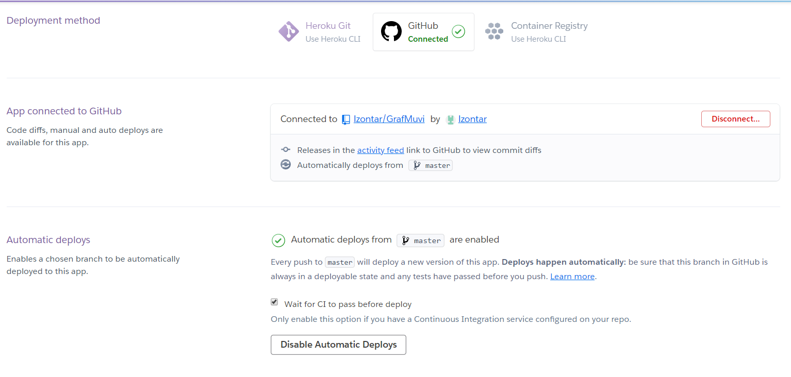
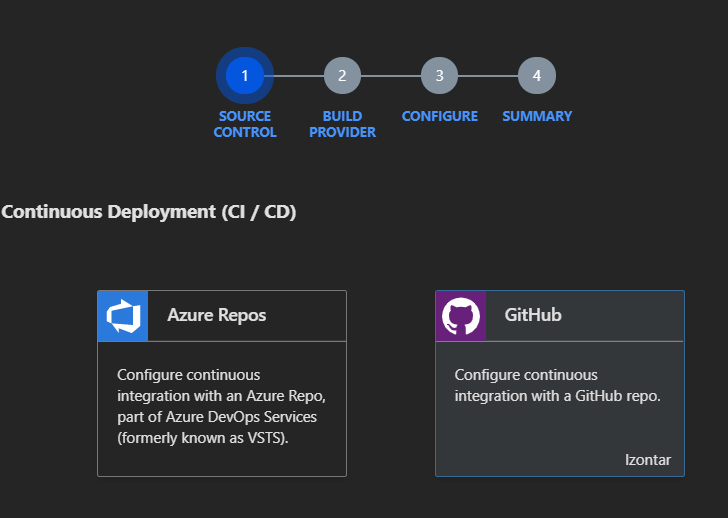
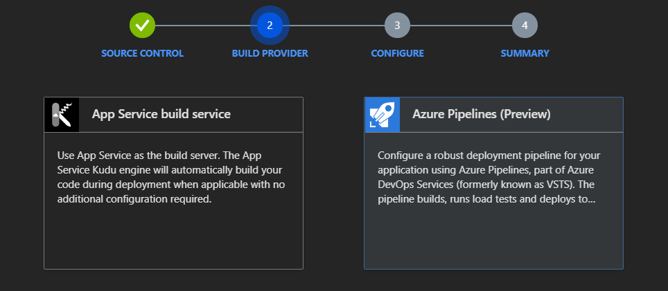
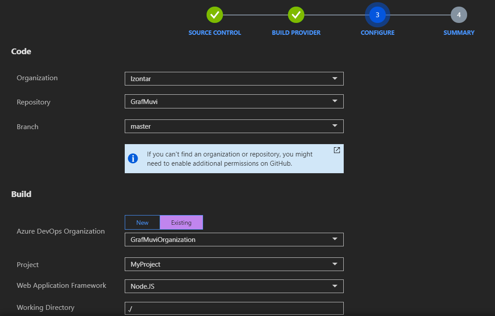
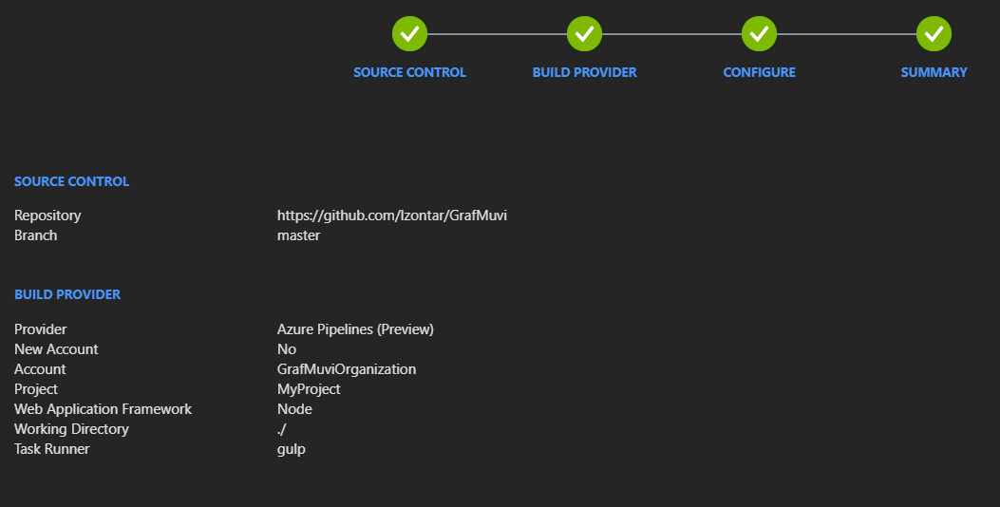
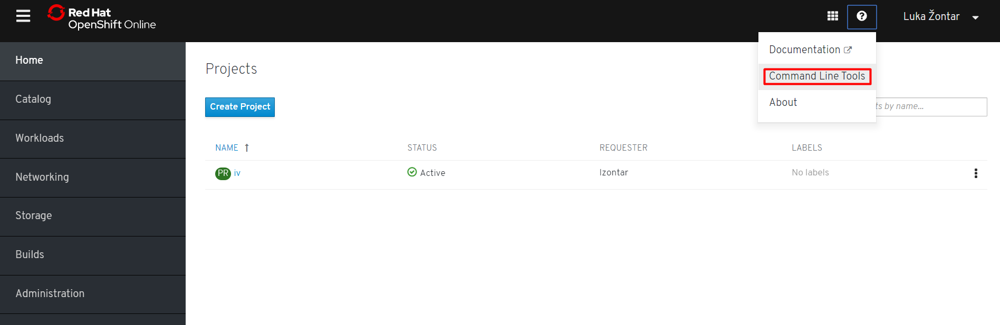

# :100: How is it deployed?
## Heroku
[Heroku](https://www.heroku.com) is one of the cloud platform as a service (PaaS) that we will use in our project. It is one of the first cloud platforms and now supports several programming languages. *Heroku* works with application containers or *dynos* (as they call them). We will use *Heroku* as our primary PaaS because it is free, because of its simplicity and its high compatibility level with GitHub.
### How does deployment work?
To put it short, source code of our application with necessary dependencies, language, framework and output of the build phase (e.g. compiled code) is firstly assembled into a slug. Before that a dyno (an isolated, virtualized Unix container which provides environment for our application) is booted and preloaded with prepared slug, specified config vars and add-ons. On created dyno our application is executed by running the default command of the language of our application or the command specified in *Procfile*. If our application becomes too complex for only one dyno, we can simply scale it by starting multiple dynos.
### Configuration file
*Heroku* uses *Procfile* to specify the commands executed on deployment. Using our Procfile we can define different processes:
- starting web server
- worker processes
- singleton processes
- processes which are run before a new release
In our application we will only define the command which starts the web server. Our Procfile should include:
```
web:  node node_modules/gulp/bin/gulp start
```
Therefore on startup ```gulp start``` is executed, which executes ```pm2 start --name GrafMuvi ./server.js```.
### Configuration
First of all we have to install [Heroku CLI](https://devcenter.heroku.com/articles/heroku-cli) on our machine. After we have configured our system soo that it can run *heroku* command in shell, we first have to login to Heroku:
```
$ heroku login
```
Now that we are logged in our Heroku account we can create a new application by executing (legally, region has to be configured correctly):
```
$ heroku apps:create --region eu grafmuvi
```
Once an application is created, a git remote *heroku* is automatically created. As indicated before our source code is transformed into a slug, which can be then executed on a dyno. But how does Heroku knows for which language to build a slug? It's using buildpacks (sets of scripts depending on programming language). We define our buildpack:
```
$ heroku buildpacks:set heroku/nodejs
```
Since Neo4j is not initially available online, we have to deploy our database. Heroku provides a great add-on (component that supports our application) called [GrapheneDB](https://elements.heroku.com/addons/graphenedb), which grants us with Neo4j database hosting. We include it in our application by executing:
```
$ heroku addons:create graphenedb:dev-free
```
Data which is necessary to access our deployed database (not only for Heroku but also for TravisCI, Shippable and local development) - Database URL, username, password - can be found in generated Heroku config vars and extracted by running:
```
$ heroku config:get GRAPHENEDB_BOLT_URL
$ heroku config:get GRAPHENEDB_BOLT_USER
$ heroku config:get GRAPHENEDB_BOLT_PASSWORD
```
Because we are using environmental variables we have to define them for Heroku. In our case we have to define DNS (for logging with Sentry), Port (default 3000), OMDB_KEY (API key for OMDB API) and since we decided to rename environmental variables that describe our deployed database we also have to set these (GRAPHENEDB_URL, GRAPHENEDB_USER, GRAPHENEDB_PASSWD) - we change <CONFIG_VAR_NAME> and <VALUE> with appropriate values:
```
heroku config:set <CONFIG_VAR_NAME>=<VALUE>
```
After we successfully configure our Heroku application we can deploy our application manually by pushing our code to a git remote heroku:
```
$ git push heroku master
```
Additionally we can also configure our application to be automatically deployed after each commit to our GitHub repository. Our settings on Heroku Dashboard should look like this (connected to our GitHub repo and enabled automatic deploys):



Furthermore we can add continuous deployment to TravisCI by adding:
```
deploy:
  provider: heroku
  api_key:
    secure: <HEROKU_API_KEY>
  app: grafmuvi
  on:
    repo: lzontar/GrafMuvi
```

# Alternatives to Heroku
If you don't want to use Heroku as PaaS there are also many other similar services. Below  you can find instructions on how to deploy your app with *Microsoft Azure* and *OpenShift*.

## Microsoft Azure
[Microsoft Azure](https://azure.microsoft.com/en-us/) is a cloud computing service developed by Microsoft. Besides Platform as a Service (PaaS) it also provides Software as a Service (SaaS) and Infrastructure as a Service (IaaS). Just as *Heroku* Microsoft Azure also supports a variety of different languages.
## How does deployment work?
*Microsoft Azure* offers two different deployment models:
1. Classic deployment model, where each resource is deployed and managed individually.
2. Azure resource manager, which enables users to create groups of resources which are deployed, managed and monitored together (we will be using this model).
### Configuration
After we install [Azure CLI](https://docs.microsoft.com/en-us/cli/azure/install-azure-cli-windows?view=azure-cli-latest) we firstly have to login into our Microsoft Azure account:
```
$ az login
```
Now we can start creating our deployment environment. Firstly we have to create user for our Microsoft Azure git remote repository:
```
$ az webapp deployment user set --user-name <USERNAME> --password <PASSWORD>
```
We have to create a resource group, which is basically a logical unit that represents a collection of assets:
```
$ az group create --name GrafMuviResourceGroup --location westeurope
```
After a resource group has been successfully created we have to create a service plan. We will create a free service plan.
```
$ az appservice plan create --name GrafMuviServicePlan --resource-group GrafMuviResourceGroup --sku FREE
```
Now we can finally create our web application. By adding ```--deployment-local-git``` a new git repository will be created for manual deploying.
```
$ az webapp create --name GrafMuvi --resource-group GrafMuviResourceGroup --plan GrafMuviServicePlan --deployment-local-git
```
Among the return results of the last command should be a line containing URL of the newly created git repository for our Microsoft Azure deployments (where *<USERNAME>* is the username of the deployment user defined earlier):
```
Local git is configured with url of 'https://<USERNAME>@grafmuvi.scm.azurewebsites.net/GrafMuvi.git'
```
For manual deploying we have to add this newly created git repository as a git remote to our application (remote will be named *azure*):
```
$ git remote add azure https://<USERNAME>@grafmuvi.scm.azurewebsites.net/GrafMuvi.git
```
We can also define the default resource group and application name:
```
$ az webapp config set --resource-group GrafMuviResourceGroup --name GrafMuvi"
```
We still have to define our environmental variables which we can do by going to our App Service *GrafMuvi->Configuration*. To actually deploy our application we have to push to git remote *azure*:
```
$ git push azure master
```
Besides manual deployments Microsoft Azure also supports Continuous Integration & Deployment (CI/CD). After each GitHub commit to specified branch our code is built with Azure Pipeline cloud service.

Firstly we have to go to our *GrafMuvi App Service* on Microsoft Azure Dashboard where we can find *Deployment Center*. There we have to select Continuous Deployment with GitHub as indicated on the picture below.



Now we select Build provider. We choose [Azure Pipelines](https://azure.microsoft.com/en-us/services/devops/pipelines/) which is a Microsoft CI/CD tool.



In the next step we have to define code and build configurations.



In the end you should get a summary such as you see below.



And it's all done. This process creates Azure DevOps organization and project (if you didn't already created them), where you can check your builds and releases.


## OpenShift
[OpenShift](https://www.openshift.com/) Container Platform is a Platform as a Service (PaaS) "built around *Docker* containers orchestrated and managed by *Kubernetes* on a foundation of *Red Hat Enterprise Linux* (RHEL).
## How does deployment work?
*OpenShift* deploys services using three different objects.
- Deployment configuration
- Replication controllers, which hold the state of deployment configuration at deployment as a pod template
- Pods, which represent an instance of application

Firstly we have to create a cluster. When creating *OpenShift Online* account, a sandbox cluster is automatically created. After downloading [oc CLI tool](https://docs.openshift.com/enterprise/3.2/cli_reference/get_started_cli.html) we first have to login into our cluster. To get our login credentials we have to click *?->Command Line Tools*. There you will find the exact command with which you can connect to your cluster.



It should look something like that:
```
$ oc login --token=<token> --server=<server>
```
Now that we are logged in we can create a new project (let's name it 'iv'):
```
$ oc new-project iv
```
After creation of our project we can create a new application. We will do that using slightly adjusted template provided with [OpenShift Node.js example](https://github.com/sclorg/nodejs-ex) which we can find in *./openshift/templates/nodejs.json*. There we can find the description of deployment configuration (such as how much memory do we allow it), GitHub repository information, app service name and description.
```
$ oc new-app -f /openshift/templates/nodejs.json
```
Now that our application is created we have to build it (to see build progress add ```--follow``` at the end):
```
$ oc start-build grafmuvi
```
During the build an app service is created but it can only be accessed locally and we have to expose it to make it globally accessible. To do this, we follow these steps:
1. ```oc get svc``` to check our app services
2. ```oc expose svc/grafmuvi``` to expose our app service
Now our app service should be globally accessible. To get URL of our deployment we can run:
```
$ oc get routes
```
Even though app service should now be deployed, our API still won't work, because we didn't yet define our environmental variables. We do that by executing:
```
$ oc set env dc/nodejs-ex <ENV_NAME>=<VALUE>
```
Where *<ENV_NAME>* is the name of our environmental variable and *<VALUE>* its value.

Additionally we could also include *continuous deployment* using *TravisCI* by adding (with corresponding values <USERNAME>, <PASSWORD> and <DOMAIN>) to our *.travis.yml*:
```
deploy:
  provider: openshift
  user: <USERNAME>
  password: <PASSWORD>
  domain: <DOMAIN>
  app: grafmuvi
  deployment_branch: master
```
