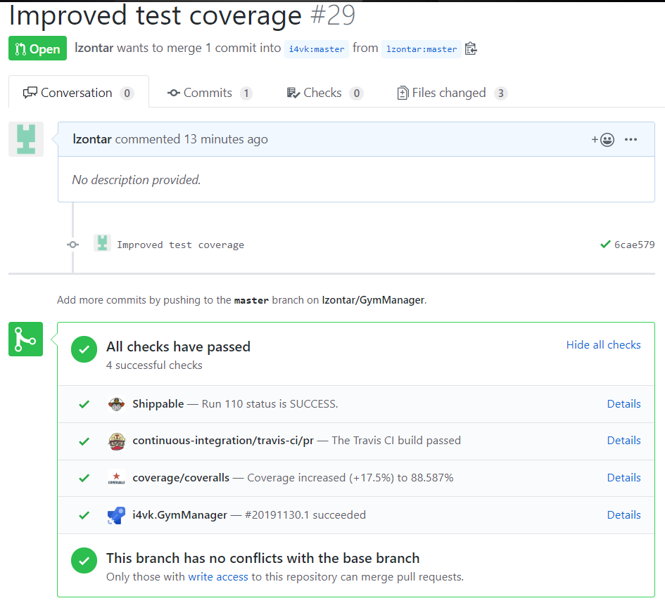
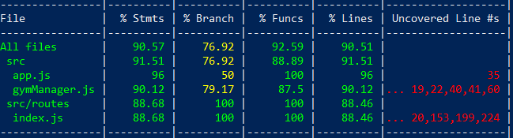

# Test coverage improvement to [GymManager](https://github.com/i4vk/GymManager)
This is the documentation of test coverage improvement for IV project of Iván Garzón Segura [GymManager](https://github.com/i4vk/GymManager).

The results of **[Corresponding PR](https://github.com/i4vk/GymManager/pull/29)** are available on the picture below:


We can see that the coverage was improved by **17.5%**.

On the picture below you can see the results of ```jest --coverage```:


### Checking error throwing
Firstly, I added some checks, if error throwing works correctly.

#### Function update(id, campo, nuevo_valor)
We added a check if update method is throwing errors correctly. Method update accepts id of client, field to be changed and the new value of the field. It changes the field *campo*  of client with id *id* to the value *nuevo_valor*. Therefore I added a check where client with nonexistent id tries to be updated. Function should fail and throw error *CannotUpdateClient*.
```
test('Función update falló', () => {
  var thrown_error = () => clientes.update("WRONG_ID", "id", "NEW_DNI");
  var expected_thrown_error = new Error("CannotUpdateClient");
  expect(thrown_error).toThrow(expected_thrown_error);
});
```

#### Function getCliente(id)
We added a check if getCliente method is throwing errors correctly. Method getCliente accepts id of client and returns a client with corresponding id. Therefore I added a check where client with nonexistent id is trying to be found. Function should fail and throw error *ClientNotFound*.
```
test('Función getCliente falló', () => {
  var thrown_error = () => clientes.getCliente("WRONG_ID");
  var expected_thrown_error = new Error("ClientNotFound");
  expect(thrown_error).toThrow(expected_thrown_error);
});
```

#### Function eliminarCliente(id)
We added a check if eliminarCliente method is throwing errors correctly. Method eliminarCliente accepts id of client and deletes it from the database. Therefore I added a check where client with nonexistent id is trying to be deleted. Function should fail and throw error *CannotDeleteClient*.
```
test('Función eliminarCliente falló', () => {
  var thrown_error = () => clientes.eliminarCliente("WRONG_ID");
  var expected_thrown_error = new Error("CannotDeleteClient");
  expect(thrown_error).toThrow(expected_thrown_error);
});
```

#### Function insert(cliente)
We added a check if insert method is throwing errors correctly. Method insert accepts JSON of a client. It inserts a new client to the database. Therefore I added a check where client without the necessary information (*nombre*,*dni*,*email*,*apellidos*)  is trying to be inserted. Function should fail and throw error *MissingClientData*.
```
test('Función insert falló - MissingClientData', () => {
  var thrown_error = () => clientes.insert({});
  var expected_thrown_error = new Error("MissingClientData");
  expect(thrown_error).toThrow(expected_thrown_error);
});
```
Furthermore I added a check where client with too many fields (extra fields, besides the obligatory ones: *nombre*,*dni*,*email*,*apellidos*) is trying to be inserted. Function should fail and throw error *ClientDataError*.
```
test('Función insert falló - MissingClientData', () => {
  var un_cliente = {nombre:"Iván",apellidos:"Garzón Segura",dni:"1234567S",email:"ivangarzon98@correo.ugr.es", adicional:"test"};
  var thrown_error = () => clientes.insert(un_cliente);
  var expected_thrown_error = new Error("ClientDataError");
  expect(thrown_error).toThrow(expected_thrown_error);
});
```

#### Function load(pathfile)
We added a check if load method is working correctly when file with path *pathfile* doesn't exist. It checks if a new JSON file with necessary JSON structure is created.
```
test('Función load falló - fichero inexistente', () => {
  var pathInexistente = path.join(__dirname, './data/inexistente.json')
  var db = clientes.load(pathInexistente);
  var expected_json = {clientes:{}}
  expect(db).toStrictEqual(expected_json);
  fs.unlink(pathInexistente, (err) => {
    if (err) {
      console.error(err)
    }
  })
});
```
### Checking endpoints
Additionally routes */* and */status* are now being tested using *supertest*. The tests that I added check *status* and the *body of HTTP response*.
```
it('Get / endpoint', (done) => {
  supertest(app)
  .get('/')
  .expect(200, {status:"OK", ejemplo:{ruta:"/clientes", valor:{
    "1": {
      "nombre": "Iván",
      "apellidos": "Garzón Segura",
      "dni": "1234567S",
      "email": "ivangarzon98@correo.ugr.es"
    },
    "2": {
      "nombre": "Antonio",
      "apellidos": "Papaya Telescopio",
      "dni": "9999999V",
      "email": "modificado@hello.com"
    },
    "3": {
      "nombre": "Rodrigo",
      "apellidos": "Rodriguez",
      "dni": "987123S",
      "email": "telescopio@correo.ugr.es"
    }
  }}})
  .end(() => {
    done()
  })
})
```

```
it('Get /status endpoint', (done) => {
  supertest(app)
  .get('/status')
  .expect(200, {status:"OK", ejemplo:{ruta:"/clientes", valor:{
    "1": {
      "nombre": "Iván",
      "apellidos": "Garzón Segura",
      "dni": "1234567S",
      "email": "ivangarzon98@correo.ugr.es"
    },
    "2": {
      "nombre": "Antonio",
      "apellidos": "Papaya Telescopio",
      "dni": "9999999V",
      "email": "modificado@hello.com"
    },
    "3": {
      "nombre": "Rodrigo",
      "apellidos": "Rodriguez",
      "dni": "987123S",
      "email": "telescopio@correo.ugr.es"
    }
  }}})
  .end(() => {
    done()
  })
})
```
